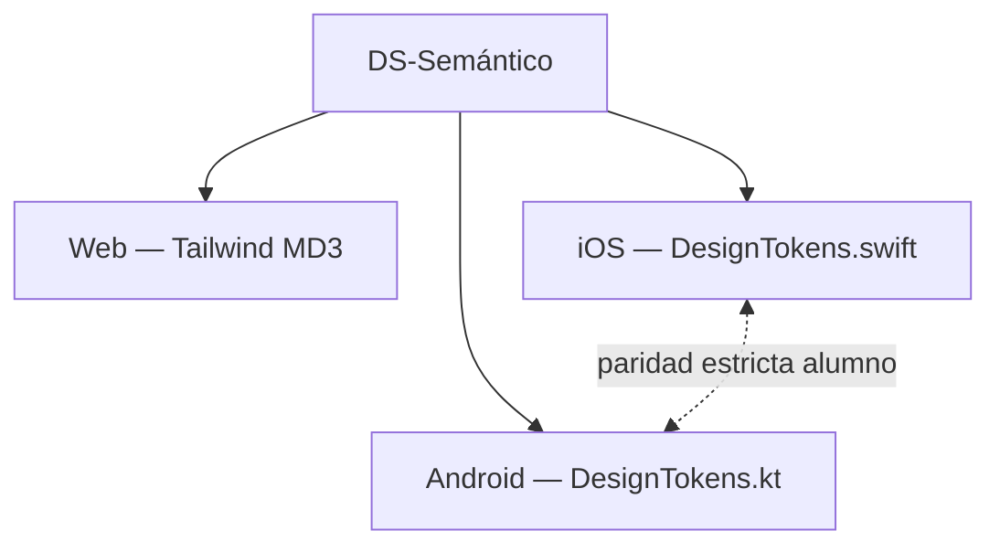

# SIPI — Design System

**Última actualización:** 2026-07-07

SIPI opera en **tres superficies**: web (admin/maestro), iOS (alumno + roles), Android (alumno + roles). No buscamos paridad pixel-perfect entre web y móvil; sí **semántica compartida** y **paridad estricta iOS ↔ Android** en el rol alumno (Capa 4-UX).

Evolución del marco de decisión: [EVOLUCION.md](EVOLUCION.md). Cola de trabajo: [ROADMAP.md](ROADMAP.md) § Capa 4-UX.

---

## Modelo de dos capas

| Capa | Qué define | Paridad |
|------|------------|---------|
| **DS-Semántico** | Significado de colores de estado, labels en español, formateadores, nombres de componentes, higiene de datos (sin UUIDs) | Web + iOS + Android |
| **DS-Plataforma** | Espaciado, tipografía, densidad, navegación | Por superficie |

---

## Madurez (DS-0 … DS-4)

| Nivel | Estado SIPI (2026-07-07) |
|-------|--------------------------|
| DS-0 Ad-hoc (`gray-*` inline) | Web **admin** (~20 páginas); **alumno + maestro grupo ✓** (2026-07-07) |
| DS-1 Tokens por plataforma | Web `tailwind.config.js`; Android ✓; iOS ✓ |
| DS-2 Contrato semántico documentado | Este doc + [DISENO-PARIDAD.md](../../sipi-mobile-android/contexto/DISENO-PARIDAD.md) — iOS D0–D3 (2026-07-07) |
| DS-3 Fuente única (`tokens.yaml`) | No — solo si DS-2 falla en práctica |
| DS-4 Verificación automática | No — capturas manuales iOS/Android por ahora |

---

## DS-Semántico (compartido)

### Colores de estado

| Rol | Significado | Web (Tailwind) | Móvil |
|-----|-------------|----------------|-------|
| `success` | Cumple / aprobado / OK | `primary` + variantes fixed | `#1E8E3E` / verde sistema |
| `pending` | Pago / lista de espera | `secondary` + fixed | `#B26A00` / ámbar |
| `error` | Error / reprobado | `error`, `error-container` | `colorScheme.error` / `.red` |
| `textSecondary` | Metadatos, hints | `on-surface-variant`, `outline` | `onSurfaceVariant` / `.secondary` |

### Componentes con nombre canónico

Misma **responsabilidad** en cada plataforma; implementación nativa.

| Componente | Web | iOS | Android |
|------------|-----|-----|---------|
| `KeyValueRow` | — (admin usa tablas) | `KeyValueRow` | `Components.kt` |
| `SectionCard` | `Card` + `CardHeader` | `SectionCard` | `SectionCard` |
| `EmptyState` | `EmptyState` | `EmptyState` | `StateViews` |
| `LoadingState` / `ErrorState` | `Loader`, `ErrorDisplay` | inline → unificar | `StateViews` |
| `Badge` | `Badge` | badges SwiftUI | `SipiColors` + chips |

### Higiene de presentación

- No mostrar UUID, `codigo` técnico ni enum crudo (`STUDENT`, `PENDIENTE_PAGO`) al usuario final.
- Dato faltante: `—` (no cadena vacía ni `null`).
- Formateadores: fecha `dd/MM/yyyy`, dinero `$350`, calificación `80` / `78.5` (sin `.0` innecesario).

### Labels en español

Fuente móvil: `Labels.kt` / `DomainLabels` (iOS). Web: mapeos en vistas de inglés y badges.

---

## DS-Plataforma — Web

**Fuente de tokens:** `frontend/tailwind.config.js` (paleta Material Design 3).

**Tipografía:** Manrope (`font-sans`, `font-headline`, `font-body`).

**Componentes base:** `frontend/src/components/ui/` — catálogo web implícito.

**Presentación web canónica:** `frontend/src/lib/designSystem.ts` (`ds.*`) — botones, cards, semántica, admin.

**Presentación alumno inglés:** re-exportada desde `designSystem.ts` vía `studentEnglishPresentation.ts` (compatibilidad).

**Alertas inglés compartidas:** `frontend/src/lib/englishAlerts.ts` — misma derivación que móvil §4.2.1.

### Reglas (leyes DS web)

1. En archivos **modificados**, no introducir clases `gray-*`, `blue-*`, `red-*` sueltas; usar tokens MD3 o `ds.*`.
2. `components/ui/*` debe usar solo tokens semánticos (referencia para IA y humanos).
3. Web admin puede ser más densa que móvil; migrar con `ds.admin.*` al tocar cada pantalla.
4. Ejecutar `npm run audit:ds` antes de cerrar un lote de migración admin.

### Preparación rediseño web (checklist)

| Fase | Qué | Estado |
|------|-----|--------|
| **W0 — Fundación** | `designSystem.ts`, `englishAlerts.ts`, `components/ui/*` en MD3, token `rounded-card` | ✓ 2026-07-07 |
| **W1 — Rol alumno** | Dashboard + 3 páginas inglés en `ds.*` | ✓ 2026-07-07 |
| **W2 — Rol maestro** | Vista única grupo en semántica DS | ✓ 2026-07-07 |
| **W3 — Admin** | Migrar `pages/admin/*` de `gray-*` → `ds.admin.*` (lote por módulo) | ✓ 2026-07-07 — inglés, SIS listas/detalle, formularios (Student, Enrollment, Group, Teacher, Subject, ExamPeriod) |
| **W4 — Rediseño** | Layout/navegación/densidad global (Stitch Academic Prestige) | ✓ 2026-07-07 — W4a shell, W4b dashboard alumno, W4c dashboards admin/maestro + errores |

**Auditoría:** `cd frontend && npm run audit:ds` — lista archivos con clases legacy.

### Espaciado web (convención Tailwind)

Usar escala Tailwind estándar (`p-4`, `gap-6`). No hay enum `Spacing.md` en web; la escala nombrada es exclusiva del par móvil.

---

## DS-Plataforma — Móvil (rol alumno)

**Contrato ejecutable:** [`sipi-mobile-android/contexto/DISENO-PARIDAD.md`](../../sipi-mobile-android/contexto/DISENO-PARIDAD.md)

**Implementación:**

- iOS: `SipiMVP/Core/DesignTokens.swift`
- Android: `app/.../core/ui/DesignTokens.kt`

### Espaciado canónico (idéntico iOS ↔ Android)

| Token | Valor |
|-------|-------|
| `xs` | 4 |
| `sm` | 8 |
| `md` | 12 |
| `lg` | 16 |
| `xl` | 24 |

### Forma

- Radio de card: **12** (`Shape.cardCornerRadius` / `shapes.medium`).

### Layout alumno (D4)

| Componente | Uso |
|------------|-----|
| `StudentScrollScreen` | Scroll + padding `md` + fondo grouped |
| `ListItemCard` | Fila de lista (inscripciones, grupos) |
| `StudentSecondaryButton` | Acción secundaria ancho completo |
| `LoadMoreFooter` | Paginación fuera de `List` |

Implementación: `sipi-mobile-ios/SipiMVP/Core/StudentLayout.swift` · `sipi-mobile-android/.../core/ui/StudentLayout.kt`.

- Un solo bundle visual web = móvil.
- React Native / Compose Multiplatform para unificar apps.
- `tokens.yaml` + codegen hasta demostrar dolor de sincronización.
- Storybook completo antes de estabilizar `components/ui/`.
- Figma como fuente de verdad obligatoria.

---

## Referencias

| Documento | Uso |
|-----------|-----|
| [ROADMAP.md](ROADMAP.md) | Cola D0–D4 y estado por capa |
| [DISENO-PARIDAD.md](../../sipi-mobile-android/contexto/DISENO-PARIDAD.md) | Detalle móvil alumno |
| [CAPTURAS-PARIDAD-UX.md](CAPTURAS-PARIDAD-UX.md) | Checklist capturas lado a lado |
| [EVOLUCION.md](EVOLUCION.md) | Hipótesis y experimentos DS |
| `sipi-mobile-ios/contexto/ROADMAP.md` | Estado iOS Capa 4-UX |
| `sipi-mobile-android/contexto/ROADMAP.md` | Estado Android Capa 4-UX |
