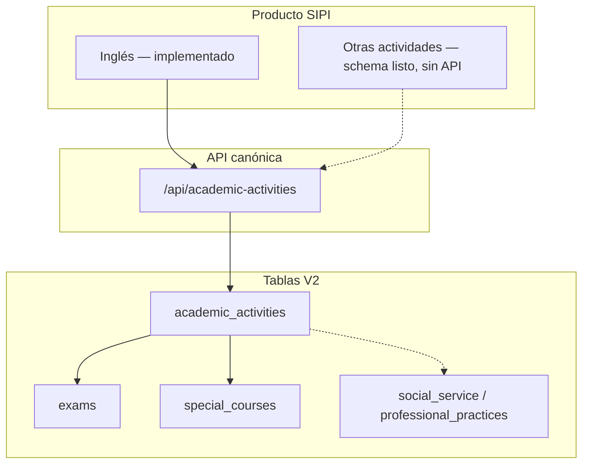

# SIPI — Alcance de producto

**Última actualización:** 2026-06-11

## Enfoque: SIPI Inglés

El producto es **SIPI Inglés**: gestionar el programa de inglés institucional de punta a punta.

| Paso | Qué cubre |
|------|-----------|
| 1 | Períodos de examen de diagnóstico (apertura, cupos, fechas) |
| 2 | Solicitud de examen por el alumno |
| 3 | Pago bancario y comprobante (cuando aplica) |
| 4 | Aprobación de pago por administración |
| 5 | Resultado del examen y **placement** (niveles 1–6) |
| 6 | Solicitud y cursado de cursos de inglés |
| 7 | Seguimiento del alumno (`promedioIngles`, niveles, certificación) |

### Soporte operativo (no es el diferenciador)

CRUD de estudiantes, maestros, materias, grupos e inscripciones **regulares** (materias no-inglés) para que admin y maestros puedan operar el plantel. Eso es infraestructura del SIS, no el núcleo del valor.

---

## Arquitectura: inglés hoy, extensible mañana

El módulo **`academic-activities`** es el **único canal** para inglés y para cualquier “actividad especial” futura.



| Recurso | Uso actual (inglés) | Extensión |
|---------|---------------------|-----------|
| `exams` + `exam-periods` | Diagnóstico, placement | Otros `ExamType` |
| `special-courses` | Cursos nivel 1–6 (`courseType: INGLES`) | Verano, talleres, etc. |
| `enrollments_v2` | — | Materias regulares vía actividades (futuro) |
| `social_service` / `professional_practices` | — | Sin API aún |

**Regla:** no añadir flujos de inglés en `enrollments` ni en columnas RB-038 de esa tabla. Los datos viejos pueden quedar en BD; los flujos nuevos van solo a V2.

---

## API canónica

```
/api/academic-activities/exams
/api/academic-activities/exam-periods
/api/academic-activities/special-courses
```

Detalle de flujos: [FLUJOS-NEGOCIO.md](FLUJOS-NEGOCIO.md).

### Retirado

```
/api/enrollments/english/*  → 410 Gone
```

---

## Roles

| Rol | Inglés | SIS básico |
|-----|--------|------------|
| **Alumno** | Solicitar examen/curso, ver progreso, pagos | Ver inscripciones regulares |
| **Maestro** | Calificar / ver alumnos en grupos de inglés | Grupos y calificaciones |
| **Admin** | Períodos, pagos, resultados de examen | Catálogos, inscripciones admin |

---

## Clientes

| Cliente | Inglés V2 |
|---------|-----------|
| Web React | Sí — inglés solo en sus pantallas (exámenes, cursos especiales, pagos); el formulario genérico de inscripciones es exclusivo de materias regulares |
| iOS | Pendiente (`academic-activities`) |

---

## Reglas de negocio

- Aprobación: **≥ 70**
- Niveles: **1–6** (validar con la institución si el requisito oficial sigue siendo 7)
- Sin diagnóstico: solo **nivel 1**
- Con diagnóstico: solo el **nivel asignado**
- **Lista de espera (cursos)**: solicitar curso sin grupo publicado ⇒ `LISTA_ESPERA` (sin pago). El admin detecta la demanda por nivel, crea grupo y asigna desde la lista; el pago se define al asignar.
- **Lista de espera (exámenes)**: primer diagnóstico sin período ⇒ `LISTA_ESPERA` (gratuito). El admin asigna período cuando publique uno; retake de diagnóstico solo vía período (puede tener costo).
- **Cancelación**: alumno cancela sus solicitudes en estados tempranos (sin resultado/calificación); admin cancela con motivo. Toda cancelación revierte cupos (período/grupo).
- **Nivel inicial (equivalencia)**: alumnos de transferencia se registran una sola vez vía `initial-level` (admin), que crea el historial canónico. Los campos de inglés de `students` nunca se editan a mano.

Más detalle: [REGLAS-NEGOCIO-ENROLLMENTS.md](REGLAS-NEGOCIO-ENROLLMENTS.md) (reglas históricas; la implementación viva está en `academic-activities`).

---

## Fuera de alcance explícito

- ERP completo (documentos, historial académico, prerequisitos) sin API
- Crear inglés vía `POST /api/enrollments`
- Duplicar lógica en tablas legacy `enrollments` (RB-038)

---

## Roadmap

1. ~~Migración Prisma V2~~
2. ~~Deprecar `/api/enrollments/english` y eliminar código legacy~~
3. ~~Cierre capa web: inglés solo en pantallas V2, typecheck en CI~~
4. iOS contra `academic-activities` — contrato en [MOBILE-API-CONTRACT.md](MOBILE-API-CONTRACT.md)
5. Android (seguimiento para alumnos) — mismo contrato
6. Opcional: otra `SpecialCourseType` cuando exista requisito de negocio

Detalle por capas y próximos pasos: [ROADMAP.md](ROADMAP.md)
