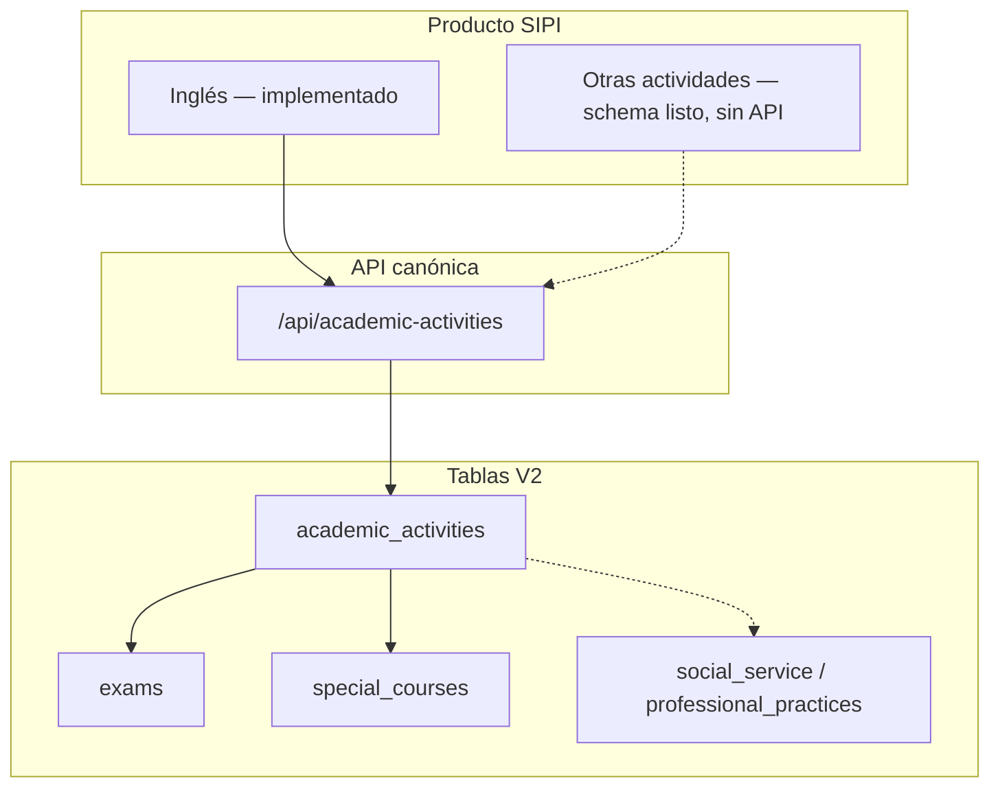

# SIPI — Alcance de producto

**Última actualización:** 2026-07-05

## Enfoque: SIPI Inglés

El producto es **SIPI Inglés**: gestionar el programa de inglés institucional de punta a punta.

| Paso | Qué cubre |
|------|-----------|
| 1 | Períodos de examen de diagnóstico (apertura, cupos, fechas) |
| 2 | Solicitud de examen por el alumno |
| 3 | Pago bancario y comprobante (cuando aplica) |
| 4 | Aprobación de pago por administración |
| 5 | Resultado del examen y **placement** (niveles 1–6) |
| 6 | Solicitud y cursado de cursos de inglés |
| 7 | Seguimiento del alumno (`promedioIngles`, niveles, certificación) |

### Soporte operativo (no es el diferenciador)

CRUD de estudiantes, maestros, materias, grupos e inscripciones **regulares** (materias no-inglés) para que admin y maestros puedan operar el plantel. Eso es infraestructura del SIS, no el núcleo del valor.

---

## Arquitectura: inglés hoy, extensible mañana

El módulo **`academic-activities`** es el **único canal** para inglés y para cualquier “actividad especial” futura.



| Recurso | Uso actual (inglés) | Extensión |
|---------|---------------------|-----------|
| `exams` + `exam-periods` | Diagnóstico, placement | Otros `ExamType` |
| `special-courses` | Cursos nivel 1–6 (`courseType: INGLES`) | Verano, talleres, etc. |
| `enrollments_v2` | — | Materias regulares vía actividades (futuro) |
| `social_service` / `professional_practices` | — | Sin API aún |

**Regla:** no añadir flujos de inglés en `enrollments` ni en columnas RB-038 de esa tabla. Los datos viejos pueden quedar en BD; los flujos nuevos van solo a V2.

---

## API canónica

```
/api/academic-activities/exams
/api/academic-activities/exam-periods
/api/academic-activities/special-courses
```

Detalle de flujos: [FLUJOS-NEGOCIO.md](FLUJOS-NEGOCIO.md).

### Retirado

```
/api/enrollments/english/*  → 410 Gone
```

---

## Roles

| Rol | Inglés | SIS básico |
|-----|--------|------------|
| **Alumno** | Solicitar examen/curso, ver progreso, pagos | — (reenfocado a inglés; "Mis Calificaciones" SIS fuera de alcance, 2026-06-24) |
| **Maestro** | Calificar cursos de inglés (`complete`); **centro de operación del grupo** (ver clase + calificar inline + herramientas: buscador, filtros, progreso, exportar CSV); avisos de urgencia por `fechaFin`; **sin costo** | Grupos asignados (listado); calificaciones de materias regulares vía `PUT /enrollments/:id` |
| **Admin** | Períodos, pagos, resultados; ciclo de vida de cursos (duplicar/cerrar/baja lógica+restaurar) | Catálogos, inscripciones admin |

---

## Clientes

| Cliente | Inglés V2 |
|---------|-----------|
| Web React | Sí — inglés solo en sus pantallas; hub "Mi Inglés" del alumno por ciclo de vida (solicitado / inscrito / historial), explorador de cursos disponibles y resumen de acciones pendientes en el dashboard; admin con dashboard de operación de inglés y **bandeja única** de aprobación de pagos (examen + curso); el formulario genérico de inscripciones es exclusivo de materias regulares. **Maestro**: vista única por grupo (`/teacher/groups/:id`) que unifica detalle, calificación inline y herramientas de clase; `/teacher/grades` es selector de grupo |
| iOS (`sipi-mobile-ios`) | Sí — journey STUDENT completo: estatus 70%, solicitar examen/curso (con lista de espera), cancelar, claridad de pago y "siguiente paso". Pendiente: roles TEACHER/ADMIN |
| Android (`sipi-mobile-android`) | Sí — journey STUDENT completo: estatus 70%, solicitar examen/curso (con lista de espera), cancelar, claridad de pago y seguimiento. Pendiente: roles TEACHER/ADMIN |

---

## Reglas de negocio

- Aprobación: **≥ 70**
- Niveles: **1–6** (validar con la institución si el requisito oficial sigue siendo 7)
- Sin diagnóstico: solo **nivel 1**
- Con diagnóstico: solo el **nivel asignado**
- **Grupos de inglés**: todo grupo marcado como de inglés debe tener **nivel 1–6** y **costo (> 0)** (ambos obligatorios al crearlo/editarlo); sin ellos no se publica. El costo se copia al `montoPago` de la solicitud, de modo que el alumno ve cuánto pagar desde que queda en `PENDIENTE_PAGO`.
- **Materia automática por nivel**: un curso de inglés se define por **nivel**, no por materia. Al crearlo, el sistema asigna sola la materia canónica `Inglés Nivel N` (clave `ING-N`); el admin **no captura ni elige materia**. El costo no se muestra al maestro (es dato administrativo).
- **Ciclo de cursos**: "cerrar" un curso lo deja en `FINALIZADO` (fuera de los vigentes, sin inscripciones). Para el siguiente periodo se **duplica** el curso del mismo nivel ajustando solo periodo y fechas; los cerrados se administran con el filtro de estatus.
- **Grupo disponible (regla única)**: el alumno ve y puede solicitar un grupo de inglés **solo** si está `ABIERTO`, dentro de su ventana de inscripción y con cupo libre. La misma regla aplica al listar (`/groups/available/english-courses`) y al solicitar (`POST /special-courses`): lo que se ve es lo que se puede solicitar.
- **Lista de espera (cursos)**: solicitar curso sin grupo publicado ⇒ `LISTA_ESPERA` (sin pago). El admin detecta la demanda por nivel, crea grupo y asigna desde la lista; el pago se define al asignar. Al asignar (`assign-group`), el admin **no** está sujeto a la ventana pública de inscripciones (coherente con `assign-period`); sí exige grupo no dado de baja, tipo/nivel, estatus `ABIERTO`/`EN_CURSO` y cupo.
- **Maestro — vista única del grupo**: operar cada clase desde una sola pantalla (detalle + calificar + herramientas); el roster muestra solo la **cohorte activa** (sin cancelados ni pendientes de pago).
- **Lista de espera (exámenes)**: primer diagnóstico sin período ⇒ `LISTA_ESPERA` (gratuito). El admin asigna período cuando publique uno; retake de diagnóstico solo vía período (puede tener costo).
- **Cancelación (alumno)**: solo en `LISTA_ESPERA` o `PENDIENTE_PAGO` (antes de que el pago sea aprobado). Tras `INSCRITO`, **no puede auto-cancelar** — debe gestionarlo en Servicio Estudiantil. Admin cancela con motivo en cualquier estado no terminal.
- **Nivel inicial (equivalencia)**: alumnos de transferencia se registran una sola vez vía `initial-level` (admin), que crea el historial canónico. Los campos de inglés de `students` nunca se editan a mano.

Más detalle: [REGLAS-NEGOCIO-ENROLLMENTS.md](REGLAS-NEGOCIO-ENROLLMENTS.md) (reglas históricas; la implementación viva está en `academic-activities`).

---

## Fuera de alcance explícito

- ERP completo (documentos, historial académico, prerequisitos) sin API
- Crear inglés vía `POST /api/enrollments`
- Duplicar lógica en tablas legacy `enrollments` (RB-038)

---

## Roadmap

1. ~~Migración Prisma V2~~
2. ~~Deprecar `/api/enrollments/english` y eliminar código legacy~~
3. ~~Cierre capa web: inglés solo en pantallas V2, typecheck en CI~~
4. iOS y Android contra `academic-activities` (mismo contrato): journey STUDENT de inglés **completo** (estatus 70%, solicitar examen/curso con lista de espera, cancelar, claridad de pago); **pendiente** roles TEACHER/ADMIN en móvil (TEACHER: vista única del grupo §4.7; ADMIN: assign-period, assign-group, waitlist/summary, initial-level). Contrato en [MOBILE-API-CONTRACT.md](MOBILE-API-CONTRACT.md)
5. Opcional: otra `SpecialCourseType` cuando exista requisito de negocio

Detalle por capas y próximos pasos: [ROADMAP.md](ROADMAP.md)

---

## Experiencia web por rol (Capa 3)

Referencia de navegación e información por rol. El detalle de pantallas del **alumno en móvil** está en [MOBILE-API-CONTRACT.md §4](MOBILE-API-CONTRACT.md); el del **maestro en móvil (futuro)** en §4.7.

### Alumno

| Destino | Propósito |
|---------|-----------|
| **Dashboard** | Identidad, métricas de inglés (nivel, progreso 70%, requisito), alertas y acceso a Mi Inglés |
| **Mi Inglés** | Hub único: progreso, exámenes/cursos, solicitudes embebidas según elegibilidad, cancelación |

**Fuera de alcance:** "Mis Calificaciones" (SIS), "Mis Grupos", solicitar examen/curso como menús sueltos, búsqueda global.

### Maestro

| Destino | Propósito |
|---------|-----------|
| **Dashboard** | Resumen de grupos, pendientes por calificar (deep-link al grupo), accesos rápidos |
| **Mis Grupos** (`/admin/groups`) | Listado de grupos asignados → clic abre la vista única |
| **Calificar** (`/teacher/grades`) | Selector de grupo → entra a la vista única |
| **Vista única del grupo** (`/teacher/groups/:id`) | Detalle + calificar inline + herramientas (buscar, filtrar, progreso, export CSV) |

**Reglas de presentación:** sin costo del curso; roster = cohorte activa; urgencia por `fechaFin` si hay pendientes.

### Admin

| Bloque sidebar | Destinos | Propósito |
|----------------|----------|-----------|
| *(común)* | Dashboard | Operación general + sección **SIPI Inglés — Operación** (acciones pendientes con filtros) |
| **General** | Materias, Grupos, Estudiantes, Maestros, Inscripciones | SIS de soporte |
| **SIPI Inglés** | Cursos de inglés, Periodos de diagnóstico, Exámenes de diagnóstico, Aprobaciones de pago | Producto: oferta, demanda, pagos y resultados |

**Operación de cursos:** duplicar/cerrar/baja lógica/restaurar desde listado de grupos (menú kebab). Búsqueda global solo admin.
