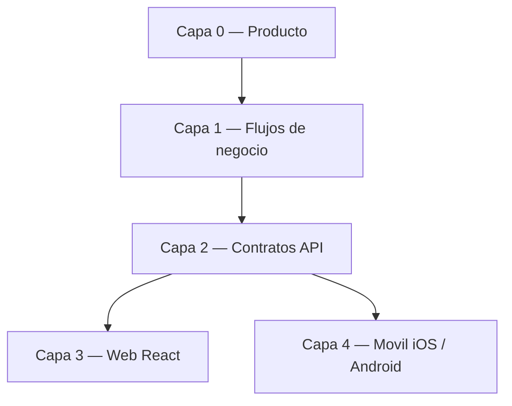

# Roadmap por capas — SIPI

Workflow producto-primero: antes de tocar código, ubicar el trabajo en una capa y validar que la capa superior lo justifica. Sirve para decidir **en qué trabajar** y evitar expansiones que distorsionen el producto.

## Capas y estado

| Capa | Fuente de verdad | Estado (2026-06-10) |
|------|------------------|---------------------|
| 0. Producto | [PRODUCTO.md](PRODUCTO.md) | **Estable** — SIPI Inglés (requisito 70%, niveles 1–6); SIS básico como soporte |
| 1. Flujos de negocio | [FLUJOS-NEGOCIO.md](FLUJOS-NEGOCIO.md) | **Estable** — diagnóstico → pago → placement → cursos → certificación |
| 2. Contratos API | [MOBILE-API-CONTRACT.md](MOBILE-API-CONTRACT.md) + `/api/academic-activities/*` | **Estable** — canónico inglés en academic-activities; legacy `/enrollments/english/*` retirado (410) |
| 3. Web (React) | `frontend/` | **Al día** — consume la API canónica para todo el flujo de inglés |
| 4a. Móvil iOS | repo `sipi-mobile-ios` | **Parcial** — MVP por roles sobre endpoints genéricos; pestaña "Inglés" pendiente (ver contrato) |
| 4b. Móvil Android | — | **No iniciado** — será la plataforma de seguimiento para disponibilidad de alumnos; partirá del mismo contrato |

## Próximos pasos (en orden)

1. **iOS — pestaña "Inglés" (alumno)**: estatus 70%, solicitar examen, solicitar curso, consumiendo `english-status` y endpoints canónicos. Limpiar campos RB-038 de `EnrollmentsModels.swift`.
2. **iOS — hardening**: filtros admin pendientes, observabilidad (R5 del roadmap iOS).
3. **Android — MVP alumno**: login + estatus de inglés + solicitudes, mismo contrato que iOS.
4. **Opcional (requiere caso de negocio)**: nueva `SpecialCourseType` (verano, talleres) u otra actividad — el schema ya lo soporta; **no** crear API sin pasar por Capa 0.

## Reglas del workflow

- Una feature nueva debe poder señalarse en la Capa 0 (PRODUCTO.md). Si no aparece ahí, primero se actualiza producto, luego se implementa.
- Cambios de API que afecten a móvil se documentan en MOBILE-API-CONTRACT.md **antes** de desplegar.
- Lo "escalable a futuro" vive solo en schema/enums (sin API ni UI) hasta que tenga justificación de producto: `social_service`, `professional_practices`, `enrollments_v2`, `prerequisites`, `student_documents`.

**Última actualización**: 2026-06-10
