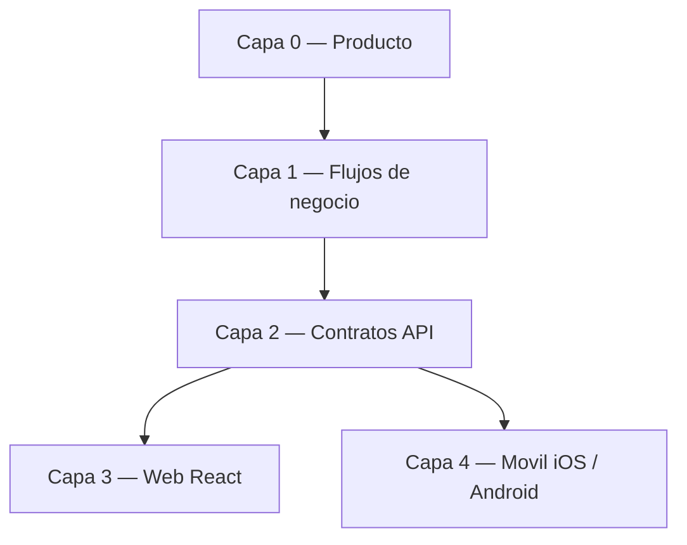

# Roadmap por capas — SIPI

Workflow producto-primero: antes de tocar código, ubicar el trabajo en una capa y validar que la capa superior lo justifica. Sirve para decidir **en qué trabajar** y evitar expansiones que distorsionen el producto.

## Capas y estado

| Capa | Fuente de verdad | Estado (2026-06-22) |
|------|------------------|---------------------|
| 0. Producto | [PRODUCTO.md](PRODUCTO.md) | **Estable** — SIPI Inglés (requisito 70%, niveles 1–6); SIS básico como soporte |
| 1. Flujos de negocio | [FLUJOS-NEGOCIO.md](FLUJOS-NEGOCIO.md) | **Estable** — diagnóstico → pago → placement → cursos → certificación; grupos de inglés con nivel obligatorio y regla única de disponibilidad |
| 2. Contratos API | [MOBILE-API-CONTRACT.md](MOBILE-API-CONTRACT.md) + `/api/academic-activities/*` | **Estable** — canónico inglés en academic-activities; legacy `/enrollments/english/*` retirado (410); regla canónica de "grupo disponible" documentada para iOS y Android |
| 3. Web (React) | `frontend/` | **Cerrada** — consume solo la API canónica para inglés; hub "Mi Inglés" del alumno por ciclo de vida; formulario de inscripciones limitado a materias regulares; typecheck (`tsc -b`) en verde y como gate en CI |
| 4a. Móvil iOS | repo `sipi-mobile-ios` | **STUDENT completo** — journey de inglés del alumno completo: estatus 70%, solicitar examen/curso (con lista de espera), cancelar, claridad de pago y "siguiente paso"; reglas de contrato aplicadas (listado==solicitud, 429/410, caché corta). **Pendiente**: alineación visual/diseño del rol alumno (Capa 4 diseño), rol ADMIN (assign-period/assign-group/waitlist/initial-level) y R5 hardening |
| 4b. Móvil Android | repo `sipi-mobile-android` | **STUDENT completo** — journey de inglés del alumno (pasos 1–7): estatus 70%, solicitar examen (con lista de espera) y curso (selección de nivel + lista de espera); mismo contrato que iOS. **Pendiente**: alineación visual/diseño del rol alumno (Capa 4 diseño), roles TEACHER/ADMIN |
| 4-UX. Diseño móvil (alumno) | repos iOS + Android | **Propuesto (no iniciado)** — alinear estructura visual de ambas apps para el rol alumno sin tocar lógica/flujos/contratos: tokens paritarios, componentes base comunes, higiene de IDs/campos crudos y plantilla de vistas compartida |

## Próximos pasos (en orden)

El journey STUDENT de inglés está completo en web, iOS y Android. La capa web (3) quedó cerrada para el alcance actual: cualquier trabajo nuevo debe venir de las capas 0–2 o del frente móvil.

1. **iOS / Android — alineación visual y diseño del rol ALUMNO (móvil)**: refactor de presentación (sin tocar lógica, flujos ni contratos) para que ambas apps compartan estructura de vistas y se vean como un mismo producto. Detalle en [Capa 4 — Alineación visual y diseño (rol alumno)](#capa-4--alineación-visual-y-diseño-rol-alumno).
2. **iOS / Android — rol ADMIN del flujo de inglés (móvil)**: assign-period, assign-group, waitlist/summary e initial-level sobre la API canónica ya existente. Es el único bloque grande pendiente en móvil.
3. **iOS / Android — hardening (R5)**: filtros admin de docentes/materias, observabilidad, snackbar de feedback, pull-to-refresh; validación end-to-end en dispositivo con alumno real.
4. **Backend + web (opcional, no bloqueante)**: exponer `montoPago` del curso en `english-status` (hoy solo el examen muestra monto) y revisar coherencia de `assign-group`/`assign-period` con la regla canónica de disponibilidad.
5. **Opcional (requiere caso de negocio)**: nueva `SpecialCourseType` (verano, talleres) u otra actividad — el schema ya lo soporta; **no** crear API sin pasar por Capa 0.

## Capa 4 — Alineación visual y diseño (rol alumno)

> **Alcance estricto**: trabajo de **presentación únicamente**. No se modifica lógica de negocio, flujos, llamadas a la API, modelos de datos ni contratos (`MOBILE-API-CONTRACT.md`). Cada punto reordena, oculta, formatea o tokeniza lo que **ya** se muestra; no agrega ni quita información del backend ni cambia navegación funcional. El rol ALUMNO es el único en alcance (es el más maduro y el del MVP).
>
> **Objetivo**: que `sipi-mobile-ios` (SwiftUI) y `sipi-mobile-android` (Compose) compartan una **misma estructura de vistas** del alumno, de modo que se perciban como un mismo producto en ambas plataformas.

### D0 — Contrato de diseño compartido (paridad de tokens)

Hoy ambas apps tienen `DesignTokens` con la **misma nomenclatura** (`Spacing.xs/sm/md/lg/xl`) pero **valores divergentes**: iOS `md=12, lg=16, xl=24` (`SipiMVP/Core/DesignTokens.swift`), Android `md=16, lg=24, xl=32` (`core/ui/DesignTokens.kt`). iOS además define `Typography` semántica; Android no.

- [ ] Acordar **una sola escala de espaciado** y replicarla idéntica en ambos `DesignTokens` (mismos valores numéricos para `xs/sm/md/lg/xl`).
- [ ] Definir **tokens de tipografía semántica** equivalentes en ambas plataformas (`screenTitle`, `sectionTitle`, `rowTitle`, `rowSecondary`, `rowMeta`). iOS ya tiene base en `Typography`; Android debe añadir un `Type`/tokens y dejar de depender solo de `MaterialTheme.typography` por defecto.
- [ ] Definir **tokens de color semántico** comunes (texto secundario, éxito/cumple, pendiente/pago, error) para no mezclar `outline` vs `onSurfaceVariant` (Android) ni `.secondary`/`.red` ad-hoc (iOS).
- [ ] Definir tokens de **forma/elevación** (radio de tarjeta) para que las cards se vean iguales; Android completar el `darkColorScheme` (hoy a medias) e inyectar tipografía en `Theme`.

### D1 — Componentes base comunes (un patrón, dos plataformas)

Ambas apps reimplementan los mismos patrones varias veces con diferencias sutiles.

- [ ] **Fila etiqueta/valor única**: iOS ya tiene `KeyValueRow`; Android tiene 4 variantes (`InfoRow`, `ProfileRow`, `KeyValue`, `MoreRow`) → unificar en un solo `KeyValueRow` con el **mismo** comportamiento de dato faltante (`—`) en ambas.
- [ ] **Tarjeta de sección** (`título + contenido`): extraer un componente compartido (`SectionCard`/`DetailCard`) y usarlo en todas las vistas; hoy se arma a mano repetidamente.
- [ ] **Estados carga/vacío/error**: Android ya tiene `StateViews` (`LoadingState`/`ErrorState`/`EmptyState`) pero la pantalla de Inglés reinventa su loader; iOS reimplementa loading/error inline en cada vista. Unificar a un set compartido y usarlo en **todas** las vistas del alumno.
- [ ] **Bloque "Cargar más"** (paginación): un solo componente reutilizable (hoy duplicado entre listas).
- [ ] **Formateadores compartidos**: fecha, dinero (con símbolo) y calificación (`formatGrade`). Aplicarlos en todas partes; hoy se imprimen `Double` crudos (`80.0`) y fechas/montos sin formato.

### D2 — Higiene de datos expuestos al alumno

Quitar de la **UI** identificadores técnicos y campos crudos que no aportan al alumno (siguen disponibles en el modelo; solo no se muestran).

- [ ] **iOS**: eliminar la fila `ID` cruda del perfil (`StudentProfileView.swift:59`) y revisar otras vistas (GroupDetail / EnrollmentDetail) por IDs/UUIDs expuestos.
- [ ] **Android**: ocultar códigos técnicos usados como título/fallback (`enrollment.codigo`, `exam.codigo`, `group.codigo` como dato principal) cuando exista un nombre legible.
- [ ] **Traducir enums a etiquetas legibles** en ambas: `estatus` del alumno, `role` (Android `MoreScreen.kt:34` muestra `STUDENT` crudo), `turno`/`modalidad`/`estatus` de grupo. Mapear a texto en español, con _fallback_ seguro para valores nuevos.
- [ ] **No renderizar tarjetas vacías**: en Android, "Materia"/"Docente" se pintan llenas de `—` cuando solo llega el `*Id` sin el objeto → ocultar la sección si no hay datos reales (criterio consistente en ambas).

### D3 — Estructura de vistas del alumno (orden y jerarquía paritaria)

Definir una **plantilla común** por pantalla y aplicarla en ambas plataformas.

- [ ] **Orden de campos del perfil** consistente y agrupado lógicamente (identidad académica → contacto/origen), idéntico en iOS y Android.
- [ ] **Colapsar bloques de una sola opción/acción**: tarjeta "Datos" del perfil (envoltorio redundante), tarjeta "Sesión"/"Más", y tarjetas de detalle de grupo con 1–2 datos útiles que fragmentan el scroll.
- [ ] **Inglés — quitar CTA duplicado**: la `NextStepCard` y la card "Acciones" repiten los mismos botones (Android `EnglishScreen.kt`); dejar un solo punto de acción primario y alinear el mismo layout en iOS.
- [ ] **Inglés — orden de bloques** coherente: siguiente paso → avance del requisito → acción primaria → historial (exámenes/cursos); evitar solapar el mensaje de "cumple/no cumple" en dos bloques.
- [ ] **Encabezado de pantalla uniforme**: todas las pantallas del alumno con el mismo tratamiento de título (hoy algunas listas no tienen título propio y otras sí).

### D4 — Estados, espaciado y navegación uniformes

- [ ] **Un solo tratamiento de "sin datos"** por pantalla (hoy conviven: filas `—` + EmptyState, secciones ocultas, y EmptyState en lista). Elegir uno y aplicarlo igual en ambas.
- [ ] **Padding de listas y espaciado interno de cards** consistente vía tokens (hoy varía entre pantallas y plataformas).
- [ ] **Énfasis de acciones consistente** (p. ej. "Cancelar" siempre con el mismo estilo de botón en todas las filas).
- [ ] **Paridad de navegación del alumno**: misma cantidad/orden de pestañas y mismo acceso a "Cerrar sesión" en ambas (Android lo esconde en "Más"; revisar nº de tabs para evitar el menú "More" del sistema). Sin cambiar destinos ni flujos, solo su presentación/orden.

### Criterios de aceptación (Capa 4 — diseño)

- [ ] Capturas lado a lado iOS/Android de las vistas del alumno mostrando estructura equivalente.
- [ ] `git diff` sin cambios en servicios, view models de lógica, modelos, networking ni contratos: solo vistas/tokens/componentes de presentación.
- [ ] Tests existentes de ambas apps siguen en verde (no se tocó lógica).
- [ ] Ningún ID/UUID técnico ni enum crudo visible en las vistas del alumno.

## Reglas del workflow

- Una feature nueva debe poder señalarse en la Capa 0 (PRODUCTO.md). Si no aparece ahí, primero se actualiza producto, luego se implementa.
- Cambios de API que afecten a móvil se documentan en MOBILE-API-CONTRACT.md **antes** de desplegar.
- Lo "escalable a futuro" vive solo en schema/enums (sin API ni UI) hasta que tenga justificación de producto: `social_service`, `professional_practices`, `enrollments_v2`, `prerequisites`, `student_documents`.

**Última actualización**: 2026-06-22 — añadida Capa 4 (diseño): alineación visual del rol alumno entre iOS y Android, sin cambios de lógica/flujos.
