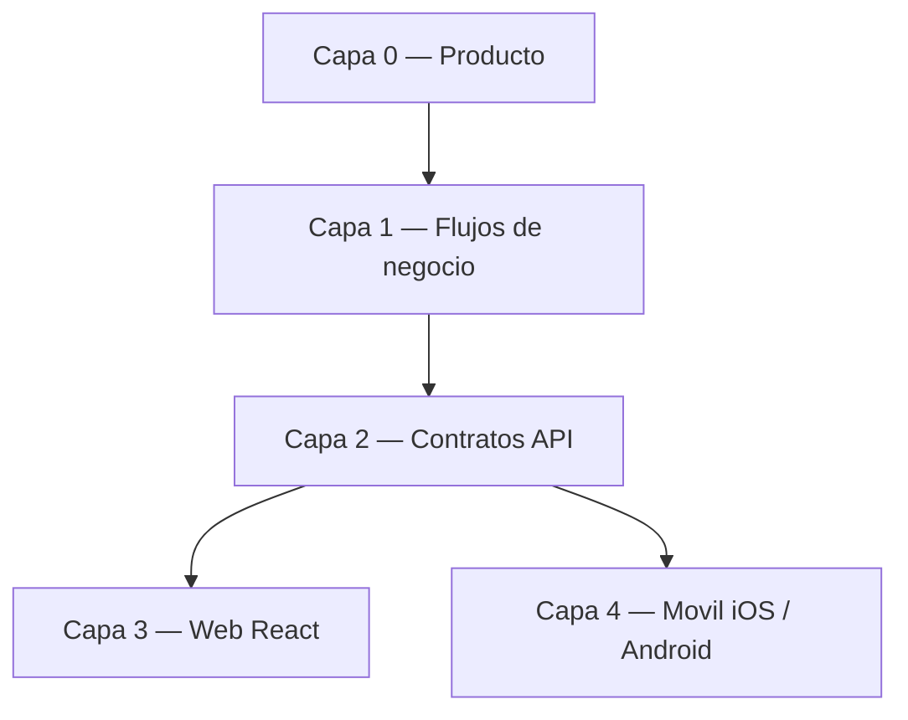

# Roadmap por capas — SIPI

Workflow producto-primero: antes de tocar código, ubicar el trabajo en una capa y validar que la capa superior lo justifica. Sirve para decidir **en qué trabajar** y evitar expansiones que distorsionen el producto.

**Design system y evolución:** [DESIGN-SYSTEM.md](DESIGN-SYSTEM.md) (tokens, componentes, paridad móvil) · [EVOLUCION.md](EVOLUCION.md) (hipótesis y decisiones).

## Capas y estado

| Capa | Fuente de verdad | Estado (2026-07-07) |
|------|------------------|---------------------|
| 0. Producto | [PRODUCTO.md](PRODUCTO.md) | **Estable** — SIPI Inglés (requisito 70%, niveles 1–6); SIS básico como soporte |
| 1. Flujos de negocio | [FLUJOS-NEGOCIO.md](FLUJOS-NEGOCIO.md) | **Estable** — diagnóstico → pago → placement → cursos → certificación; grupos de inglés con nivel obligatorio y regla única de disponibilidad |
| 2. Contratos API | [MOBILE-API-CONTRACT.md](MOBILE-API-CONTRACT.md) + `/api/academic-activities/*` | **Estable** — canónico inglés en academic-activities; legacy `/enrollments/english/*` retirado (410); RBAC en `GET /api/groups/:id` y `GET /api/enrollments/:id` (403); rate limit estricto en search/export; regla canónica de "grupo disponible" documentada |
| 3. Web (React) | `frontend/` | **Cerrada (features)** — **DS preparado para rediseño** (W0–W2 ✓ 2026-07-07): `designSystem.ts`, alumno + maestro en tokens MD3; admin pendiente W3 (`npm run audit:ds`). Ver [DESIGN-SYSTEM.md](DESIGN-SYSTEM.md) § Preparación rediseño. |
| 4a. Móvil iOS | repo `sipi-mobile-ios` — roadmap: [`contexto/ROADMAP.md`](../../sipi-mobile-ios/contexto/ROADMAP.md) | **STUDENT completo** — 3 tabs homologados. **Capa 4-UX D0–D5k ✓** (código). Pendiente: **R5 E2E** en dispositivo; **TEACHER/ADMIN** (web-first) |
| 4b. Móvil Android | repo `sipi-mobile-android` — roadmap: [`contexto/ROADMAP.md`](../../sipi-mobile-android/contexto/ROADMAP.md) | **STUDENT completo** — paridad iOS. **Capa 4-UX D0–D5k ✓**. Pendiente: R5 E2E; TEACHER/ADMIN web-first |
| 4-UX. Diseño móvil (alumno) | repos iOS + Android + [CAPTURAS-PARIDAD-UX.md](CAPTURAS-PARIDAD-UX.md) | **D0–D5e ✓** · **D5g–D5k ✓** (2026-07-07). Capturas en `docs/images/paridad-ux/`. Pendiente: R5 E2E |

## Próximos pasos (en orden)

El journey STUDENT de inglés está completo en web, iOS y Android. La capa web (3) quedó cerrada para el alcance actual: cualquier trabajo nuevo debe venir de las capas 0–2 o del frente móvil.

1. **R5 — E2E alumno en dispositivo** — [E2E-SETUP.md](E2E-SETUP.md) + [CHECKLIST-E2E-ALUMNO.md](CHECKLIST-E2E-ALUMNO.md).
2. **iOS / Android — rol TEACHER (móvil, opcional / web-first)**: vista única del grupo alineada con web (§4.7) solo si hay demanda real; web canónica para staff.
3. **iOS / Android — rol ADMIN (móvil, opcional)**: assign-period, assign-group, waitlist/summary e initial-level — pospuesto; web canónica.
4. **iOS / Android — hardening (R5 restante)**: filtros admin de docentes/materias, observabilidad, snackbar de feedback; pull-to-refresh ya en STUDENT.
5. ~~**Backend (no bloqueante)**: coherencia de `assign-group` con la regla canónica de disponibilidad~~ (**hecho 2026-06-24**): el admin usa regla "asignable" (tipo/nivel + no eliminado + `ABIERTO`/`EN_CURSO` + cupo, **sin** ventana pública); el alumno conserva la regla canónica completa. Ver `GroupValidators.englishGroupAssignable` y MOBILE-API-CONTRACT §2.3.
6. ~~**Endurecimiento de seguridad backend/web (P0–P2, 2026-07)**~~ — Helmet, RBAC `GET /api/groups/:id`, `ForbiddenError` en enrollments, JWT ≥32 chars, `strictLimiter` en search/export, tests RBAC en CI. Detalle: [SECURITY.md](../SECURITY.md). **P3** opcional: upgrade `exceljs`, supertest HTTP, política de contraseñas.
7. **Opcional (requiere caso de negocio)**: nueva `SpecialCourseType` (verano, talleres) u otra actividad — el schema ya lo soporta; **no** crear API sin pasar por Capa 0.

### Mantenimiento aplicado (2026-06-24)

Trabajo de robustez dentro del alcance cerrado (sin features nuevas):

- **Fix**: `getAllExams` usaba `exams: { some }` sobre una relación uno-a-uno → 400 en la bandeja de aprobaciones. Corregido a filtro directo.
- **Hardening de tipos**: los `where` de `getAllExams`/`getAllSpecialCourses` se tiparon con los input types de Prisma (`Prisma.*WhereInput`); un `some` sobre relación 1-1 ahora es error de compilación, no un 400 en runtime.
- **Tests de regresión**: `exams.service`/`special-courses.service` fijan la forma del filtro (relación directa, exclusión de completados por diagnóstico, paginación).
- **Auditoría de navegación**: `frontend/scripts/audit-navigation.mjs` (`npm run audit:nav`) cruza menú × rutas para detectar links rotos y menús visibles para roles que la ruta rechazaría.

### Pasada por rol + ciclo de vida de cursos (2026-06-24, sesión 2)

Mejoras de producto por rol y administración de cursos de inglés (web + backend), documentadas en PRODUCTO/FLUJOS/MOBILE-API-CONTRACT:

- **Maestro**: **vista única del grupo** (`/teacher/groups/:id`) — detalle (horario, cupo, badges, urgencia por `fechaFin`) + **calificación inline** + herramientas de clase (buscador, filtros todos/sin calificar/aprobados/reprobados, resumen de progreso/promedio, exportar roster CSV); `/teacher/grades` es **selector de grupo** que entra a esa vista; **costo oculto** (dato administrativo).
- **Alumno**: reenfocado a inglés — se elimina "Mis Calificaciones" (SIS fuera de alcance): menú, dashboard, ruta y página; contrato móvil a 2 tabs + perfil.
- **Admin — ciclo de vida del curso de inglés**: **duplicar para nuevo periodo** (pre-llena alta), **cerrar** (`PUT estatus=FINALIZADO`), **baja lógica** (`DELETE` marca `deletedAt`) + **restaurar** (`POST /:id/restore`) + **historial** (`GET /api/groups?eliminados=true`); filtros de estatus (lista por comas) y tipo; **materia canónica por nivel** (`ING-N` automática, `subjectId` opcional al crear inglés). Acciones de tarjeta unificadas en menú **kebab**.
- **Backend hardening**: `PUT /api/groups/:id` acepta cualquier campo (antes exigía nombre/periodo/subjectId/teacherId → 400 al cerrar); código de grupo `GRP-NNNNNN` desde el mayor sufijo (no `count()`, evita colisión al duplicar); invalidación de caché del listado en crear/editar/cerrar/eliminar/restaurar; **`assign-group` con regla admin "asignable"** (sin ventana pública de inscripciones).

### Vista única del maestro (2026-06-24, sesión 3)

Unifica lo que antes eran dos pantallas desconectadas (detalle de solo lectura + calificar en otra ruta):

- **`/teacher/groups/:id`**: centro de operación de la clase — encabezado del grupo, resumen de calificación (progreso %, promedio, aprobados/reprobados/pendientes), roster de la **cohorte activa** con calificación inline (inglés vía `PUT .../special-courses/:id/complete`; regulares vía `PUT /api/enrollments/:id`), buscador por nombre/matrícula, filtros y export CSV.
- **`/teacher/grades`**: selector de grupos (`GroupCard` con pendientes) → deep-link a la vista única.
- **Dashboard**: "Pendientes por calificar" enlaza directo al grupo (`/teacher/groups/:id`), no a una pantalla genérica.

Sin cambios de API: reutiliza `GET /api/groups/:id`, `GET /api/enrollments/group/:groupId` y los endpoints de calificación existentes.

### Endurecimiento de seguridad (2026-07-06/07)

Trabajo de hardening dentro del alcance cerrado (sin features de producto nuevas). Documentado en [SECURITY.md](../SECURITY.md) y reflejado en MOBILE-API-CONTRACT §2.4, §3 y §5:

- **P0**: Helmet (CSP compatible SPA); **`GET /api/groups/:id`** con RBAC (ADMIN / TEACHER propio / STUDENT inscrito); grupos eliminados → 404 para no-admin; **`costo` omitido en API** para TEACHER (listado y detalle); `react-router-dom` ≥ 7.18.
- **P1**: `ForbiddenError` (**403**) en `GET /api/enrollments/:id` sin permiso; sanitización de 500 en producción; `JWT_SECRET` ≥ 32 chars; `requestCache` limpiado en logout/401 (web).
- **P2**: **`strictLimiter`** (10 req/hora) en `GET /api/search` y `GET /api/export/*`; tests RBAC en CI (`groups.access`, `enrollments.access`, `auth.middleware`).

## Capa 4 — Alineación visual y diseño (rol alumno)

> **Alcance estricto**: trabajo de **presentación únicamente**. No se modifica lógica de negocio, flujos, llamadas a la API, modelos de datos ni contratos (`MOBILE-API-CONTRACT.md`). Cada punto reordena, oculta, formatea o tokeniza lo que **ya** se muestra; no agrega ni quita información del backend ni cambia navegación funcional. El rol ALUMNO es el único en alcance (es el más maduro y el del MVP).
>
> **Objetivo**: que `sipi-mobile-ios` (SwiftUI) y `sipi-mobile-android` (Compose) compartan una **misma estructura de vistas** del alumno, de modo que se perciban como un mismo producto en ambas plataformas.

### D0 — Contrato de diseño compartido (paridad de tokens)

Hoy ambas apps tienen `DesignTokens` con la **misma nomenclatura** (`Spacing.xs/sm/md/lg/xl`) pero **valores divergentes**: iOS `md=12, lg=16, xl=24` (`SipiMVP/Core/DesignTokens.swift`), Android `md=16, lg=24, xl=32` (`core/ui/DesignTokens.kt`). iOS además define `Typography` semántica; Android no.

- [x] Acordar **una sola escala de espaciado** y replicarla idéntica en ambos `DesignTokens` (mismos valores numéricos para `xs/sm/md/lg/xl`). **iOS alineado 2026-07-07** (md12/lg16/xl24); Android ya en paridad.
- [x] Definir **tokens de tipografía semántica** equivalentes en ambas plataformas (`screenTitle`, `sectionTitle`, `rowTitle`, `rowLabel`, `rowValue`, `rowSecondary`, `rowMeta`). iOS: `DesignTokens.Typography` (2026-07-07).
- [x] Definir **tokens de color semántico** comunes (texto secundario, éxito/cumple, pendiente/pago, error) — iOS hex adaptativo `#1E8E3E`/`#66BB6A`, `#B26A00`/`#FFB74D` (2026-07-07).
- [x] Definir tokens de **forma/elevación** (radio de tarjeta 12) — `SectionCard` iOS + Android.

### D1 — Componentes base comunes (un patrón, dos plataformas)

Ambas apps reimplementan los mismos patrones varias veces con diferencias sutiles.

- [x] **Fila etiqueta/valor única**: `KeyValueRow` con `rowLabel`/`rowValue` en iOS (2026-07-07).
- [x] **Tarjeta de sección**: `SectionCard` en iOS (2026-07-07).
- [x] **Estados carga/vacío/error**: `LoadingState` / `ErrorState` / `EmptyState` en iOS + `StateSections` para listas.
- [x] **Bloque "Cargar más"**: `ListLoadMoreSection` sin meta de servidor (paridad Android).
- [x] **Formateadores**: `AppFormat.date` → `dd/MM/yyyy` en iOS (2026-07-07).

### D2 — Higiene de datos expuestos al alumno

Quitar de la **UI** identificadores técnicos y campos crudos que no aportan al alumno (siguen disponibles en el modelo; solo no se muestran).

- [x] **iOS**: eliminar IDs/UUIDs como título en inglés y perfil (2026-07-07); revisar GroupDetail / EnrollmentDetail pendiente menor.
- [x] **Traducir enums a etiquetas legibles**: `DomainLabels.role` → Alumno/Maestro; `activityStatusLabel` en iOS (2026-07-07).
- [ ] **No renderizar tarjetas vacías**: en Android, "Materia"/"Docente" se pintan llenas de `—` cuando solo llega el `*Id` sin el objeto → ocultar la sección si no hay datos reales (criterio consistente en ambas).

### D3 — Estructura de vistas del alumno (orden y jerarquía paritaria)

Definir una **plantilla común** por pantalla y aplicarla en ambas plataformas.

- [x] **Orden de campos del perfil** — iOS `SectionCard` datos académicos + sesión (2026-07-07).
- [x] **Inglés — CTA único**: `NextStepCard` con botón en tarjeta; solicitudes en sheet (iOS 2026-07-07).
- [x] **Inglés — orden de bloques**: siguiente paso → avance → niveles → examen pendiente → historial (iOS + Android 2026-07-07).
- [x] **Inglés — D5k historial sin duplicar activo**: `Mis exámenes` excluye `pendingExam.id` (`historicalDiagnosticExams` en `EnglishJourney`).
- [x] **Encabezado de pantalla uniforme**: `navigationTitle` por tab + `screenTitle` en Inicio (iOS D4, 2026-07-07).

### D4 — Estados, espaciado y navegación uniformes

- [x] **Un solo tratamiento de "sin datos"**: `EmptyState` full-screen — iOS + Android 2026-07-07.
- [x] **Padding y espaciado vía tokens**: `StudentScrollScreen`, `ListItemCard`, `SectionCard` con `Spacing.md` — iOS + Android 2026-07-07.
- [x] **Énfasis de acciones consistente**: `StudentSecondaryButton`; cancelar destructivo — iOS + Android 2026-07-07.
- [x] **Paridad de navegación**: 3 tabs (Inicio, Mi Inglés, Perfil); sin Calificaciones SIS; logout solo en Perfil.

### D5 — Paleta Academic Prestige (referencia web W4 / Stitch)

> **Alcance:** presentación únicamente (igual que D0–D4). Sin cambios en API, view models de negocio, `englishAlerts` ni textos de alerta. Paridad **iOS ↔ Android** obligatoria en cada lote.

**Fuente de hex:** `frontend/tailwind.config.js` + [DESIGN-SYSTEM.md](DESIGN-SYSTEM.md) § D5 móvil.

#### D5a — Tokens MD3 en `DesignTokens` (iOS + Android)

- [x] Añadir struct/enum **`SipiColor`** (o equivalente) con tokens MD3: `primary`, `primaryContainer`, `tertiaryFixed`, `tertiaryFixedDim`, `surface`, `onSurface`, `error`, etc. — **mismos hex en ambas plataformas**.
- [x] Mapear aliases semánticos D0: `success` → `primary`/`primaryFixed`; `pending` → `onTertiaryFixedVariant`/`tertiaryFixedDim` (gold, alineado a web post-W4).
- [x] Actualizar `DISENO-PARIDAD.md` (repo Android) y roadmaps `contexto/ROADMAP.md` en iOS/Android.
- [ ] Modo oscuro: diferido (web lo soporta; móvil puede quedarse en claro para D5).

#### D5b — Theme / chrome global

- [x] **Tab bar** y **navigation bar**: tint `primary` (#001917).
- [x] Botón primario: fondo `primary`, texto `onPrimary`.
- [x] Botón secundario / cancelar: borde `outlineVariant`, sin grises sueltos.

#### D5c — Tab Inicio (hero + métricas)

Reutilizar datos ya mostrados; reskin como web `DashboardStudent` W4b:

- [x] **Hero** `primaryContainer`: nombre completo, estatus, matrícula, carrera, semestre.
- [x] **Card progreso inglés** (si `english-status` ya en Inicio): barra gold + link a tab Mi Inglés.
- [x] **Pendientes**: lista derivada de las mismas reglas que `buildEnglishAlerts` (textos ya en cliente móvil — solo estilo Stitch).

#### D5d — Tab Mi Inglés

- [x] Indicador circular o barra de niveles con `tertiaryFixedDim` (como gauge web).
- [x] Chips de estado: gold pendiente/pago, `error-container` rechazo, `primaryFixed` al día.
- [x] `NextStepCard` / CTA: borde o fondo acento gold; botón primario verde midnight.

#### D5e — Capturas y cierre

- [x] Regenerar capturas § [CAPTURAS-PARIDAD-UX.md](CAPTURAS-PARIDAD-UX.md) (Inicio, Mi Inglés, Perfil). **iOS + Android ✓ 2026-07-07** (scroll cursos iOS opcional).
- [x] Verificar: sin UUID visible; 3 tabs; logout solo Perfil (Android capturas D5).
- [x] `compileDebugKotlin` + build iOS en verde (2026-07-07).

#### Opcional D5f — Tipografía Manrope

- [ ] Embeber Manrope en iOS/Android para paridad con web. **No bloqueante** — sistema nativo OK si el producto prioriza velocidad.

**Orden recomendado:** D5a → D5b → D5c → D5d → D5e (un PR por lote o iOS+Android juntos en el mismo lote).

#### D5g–D5k — Micro-paridad UX (post-D5e)

| Lote | Tema | Estado |
|------|------|--------|
| **D5g** | Auditoría visual alumno (iconos, hero, copy, CTAs) | ✓ 2026-07-07 |
| **D5h** | Cards `surfaceContainerLowest` + borde | ✓ 2026-07-07 |
| **D5i** | Títulos inline / modales / labels fila | ✓ 2026-07-07 |
| **D5j** | `%` completado, `KeyValueRow` pago, dividers, loader boot | ✓ 2026-07-07 |
| **D5k** | Historial sin duplicar `pendingExam` | ✓ 2026-07-07 — ver [PRODUCTO.md](PRODUCTO.md) § alumno móvil |

Detalle ítem a ítem: `sipi-mobile-android/contexto/DISENO-PARIDAD.md`.

### Criterios de aceptación (Capa 4 — diseño)

- [x] Capturas lado a lado iOS/Android de las vistas del alumno (2026-07-07, `docs/images/paridad-ux/`).
- [x] `git diff` sin cambios en servicios, view models de lógica, modelos, networking ni contratos: solo vistas/tokens/componentes de presentación.
- [x] Compilación/tests de presentación en verde (Android `compileDebugKotlin` 2026-07-07).
- [x] Ningún ID/UUID técnico ni enum crudo visible en las vistas del alumno.

## Reglas del workflow

- Una feature nueva debe poder señalarse en la Capa 0 (PRODUCTO.md). Si no aparece ahí, primero se actualiza producto, luego se implementa.
- Cambios de API que afecten a móvil se documentan en MOBILE-API-CONTRACT.md **antes** de desplegar.
- Lo "escalable a futuro" vive solo en schema/enums (sin API ni UI) hasta que tenga justificación de producto: `social_service`, `professional_practices`, `enrollments_v2`, `prerequisites`, `student_documents`.

### Stack toolchain (2026-09-01)

Actualización controlada sin features de producto:

- **Node 22 LTS** — `.nvmrc`, Drone CI, docs (mínimo 20.19 / 22.12+).
- **Frontend** — Vite 8, `@vitejs/plugin-react` 6, `react-router@8.3.1`; TypeScript 5.9; ESLint 9 (deuda `no-explicit-any` pendiente).
- **Backend** — branch `chore/prisma-7-upgrade`: Prisma **7.10** + adapter MariaDB; TypeScript 5.9 + ts-node. Ver [setup/PRISMA-7-MIGRATION.md](setup/PRISMA-7-MIGRATION.md).
- **Audit** — frontend 0; backend Prisma 7: revisar `mariadb` transitivo (adapter obligatorio).

Detalle operativo (Mac, Pi, Drone, upgrade Node): [setup/NODE-STACK.md](setup/NODE-STACK.md).

**Pospuesto:** TypeScript 7 backend (tsx), ESLint 10.

**Producto pendiente:** R5 E2E — [E2E-SETUP.md](E2E-SETUP.md).

**Última actualización**: 2026-09-01 — Stack toolchain + Capa 4-UX **D0–D5k ✓**. Pendiente: R5 E2E en dispositivo.
